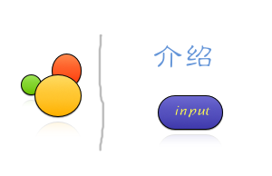

***

###You should know Before start
***

* 我采用 **box** 排版（即 **display:box**），但是我只选择兼容了 **webkit** 引擎得浏览器， ~~**webkit**什么的得最喜欢了~~ 之所以用 **box** 而不是 **flex** ，是因为 **safari** 不支持 **flex** 得一切特性。

* **html** 中最外层 **div** 表示一个屏幕，它在 **css** 中的长宽高是我乱写的 ~~不服求打~~ ，**scroll.js**会根据当前浏览器得屏幕高和宽自动调整。

* 我通过给 **window** 这个全局对象添加属性，来实现模块化，因为全局对象 **window** 只有一个，所以我们可以通过控制 **script** 加载顺序（把模块先安装到 **window** 的属性中，再在其他文件中通过 **window** 调用这个属性），实现模块化。

* **scroll.js** 实现对最外层 **div** 大小的调整，以及对点击按钮触发 **scroll** 这个动作得实现。——其实我觉得这个模块我写得并不优美。

* **game.js** 是游戏本身。

* **start.js** 调用 **window** 中所有已安装得属性，所以写完一个模块后，在 **start.js** 中统一调用。

* **Direction.js** 为中央调控台，所有后期可能需要调节得参数全部写在这，因此，**Direction.js** 这个 **script** 这个脚本必须最先记载，而相应的 **start.js** 必须最后加载。使用方法如下：
		``` 
			var Direction = window.Direction,
					NPCMINSIZE = Direction.npcMinSize;
		```
		
* **quadtree_circle.js**为四叉树算法，不用去看。

***

###What shall we do 
***

1. 在第一屏，我们需要修改背景，修改标题样式，
	在中间还需要像这样：

2. 在第二屏，我们需要写上漂亮的操作说明。

3. 在第三屏，放上游戏。

4. 在第四屏，黑色部分，我们需要写上about us ,白色部分内容只暂未定。

***